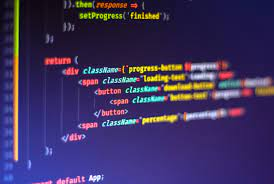
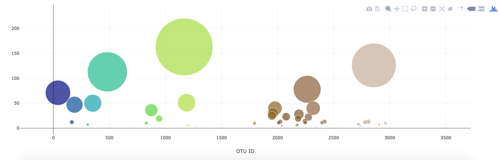

# Analyzing-Data-With-Javascript
Build an interactive dashboard to explore the dataset.

* Use the D3 library
* Create Bar charts and Buble Charts
* Use functions 
* Updat all of the plots any time that a new sample is selected

## Belly Button Biodoversity

Explore a dataset that reveals a small handful of microbial species (also called operational taxonomic units, or OTUs) were present in more than 70% of people, while the rest were relatively rare.

Use D3 library to read in samples.json. Create a horizontal bar chart with a dropdown menu to display the top 10 OTUs found in that individual.

Create a bubble chart that displays each sample

Display the sample metadata or individual demographic meta data

## Summary
Anaylyzing Data With Javascript combines front end development with backend development to create an interactive dashboard. Use D3 to read samples.json. Build charts using data from samples.json. Create a function to initalyze a change in the dashboard when a user selcts a new Id.

